# Pragmatic APIs 101

_William Durand — October 29th, 2016 — Symfony Camp UA_

---

## What's REST?

----

### REpresentational State Transfer

REST is the underlying architectural principle of the web.

It is formalized as a set of constraints, described in **Roy Fielding**'s PhD dissertation.

----

### Richardson Maturity Model


----

### Levels 0, 1, and 2

* It is all about **resources**
* **Client** uses specific HTTP **verbs**
* **Server** uses HTTP **status codes**
* Content Negotiation

----

### Level 3 - Hypermedia Controls

* Service discovery via **relations**
* **Hypermedia** formats (e.g. _HTML_, _HAL_, _JSONAPI_)
* Resources are not important, their **representations** are!
* URI design does **not** matter (URI template)
* **Client's experience** is crucial!
* Protocol & **application semantics**

----

### HATEOAS

**H**ypermedia **A**s **T**he **E**ngine **O**f **A**pplication **S**tate
<br>
<br>

It means that hypermedia should be used to find your
<br>way through the API.  It is all about **state
transitions**.

Your application is just a big **state machine**.

----

### Resource vs Representation

A **resource** can be anything, and can have more than one representation. A **representation** describes resource state.

----

### Protocol Semantics

How the underlying resource should behave under HTTP?

----

### Application Semantics

What, **specifically**, will happen to the
<br>application or resource state?

----

### The Semantic Challenge*

Some standards have a good protocol-level
semantics but no application-level
semantics (_Collection+JSON_, _Atom_).
<br>
<br>
Some standards define a lot of application-level semantics but no protocol semantics (_Microformats_, _Microdata_).

<br>
<small>
&#42; = as described in Richardson and Amundsen's “RESTful Web APIs” book
</small>

----

### Profiles

A **profile** is **defined** to not alter the semantics of the<br>resource representation
itself, but **to allow clients to<br>learn about additional semantics**, [RFC 6906](https://tools.ietf.org/html/rfc6906).
<br>
<br>
Does not have to be **machine-readable** but recommended.

----

### Examples

* Traditional API documentation
* _XMDP_ (for _XHTML_ documents)
* _**ALPS**_ (_XMDP_ on steroids)
* Embedded doc. (as in _HAL_/_Siren_)
* _JSON-LD_, _**JSON Schema**_

---

## State Of The ~~Art~~ Industry

----

### We all want RESTful APIs

----


### Yes.

----

### Is My API RESTful When I Use JSON?

_[Short answer: **no**. Long answer: no, not yet.
<br>RESTful API must use hypermedia formats. JSON is
<br>**not** a hypermedia format](http://restcookbook.com/Mediatypes/json/),
The REST CookBook_.

----

### No Relations = No REST

_[If the engine of application state (and hence the
API)
<br>is not being driven by hypertext, then it
cannot be
<br>RESTful and cannot be a REST API](http://roy.gbiv.com/untangled/2008/rest-apis-must-be-hypertext-driven), Roy Fielding_.

----

### s/REST/HTTP++/

REST APIs are a myth, _i.e._ too complex in real life.

<br>

_[99.99% of the RESTful APIs out there aren’t fully
compliant<br>with Roy Fielding’s conception of
REST](http://www.timelessrepo.com/haters-gonna-hateoas), Steve Klabnik_.

----

### Are we all screwed and should<br>we all jump to GraphQL?

----

### Nope.

---

## The Pragmatic Way

Well-designed, pragmatic, and future-proof APIs.

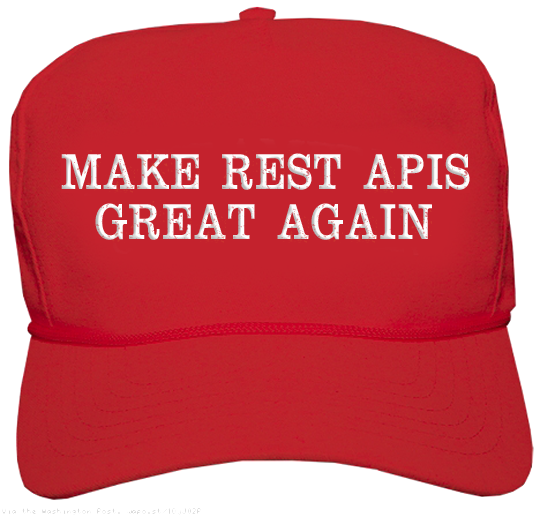


---

## <i class="fa fa-book"></i> Documentation

----

### API Blueprint<br>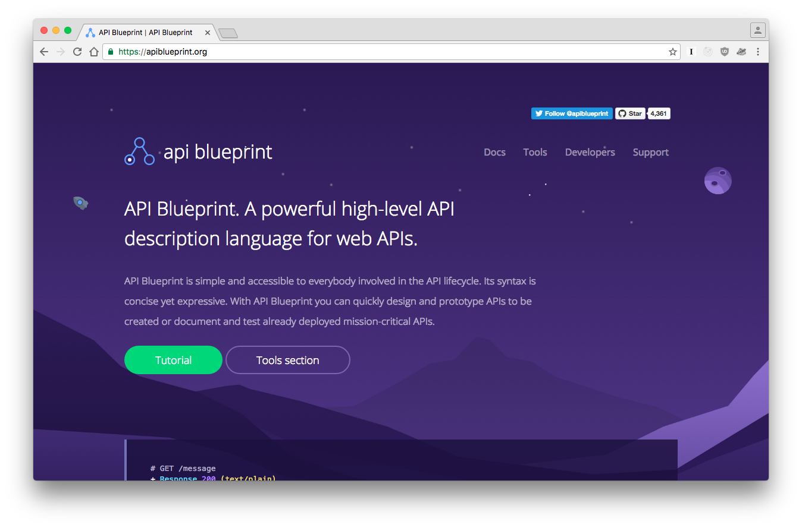

----

### Apiary<br>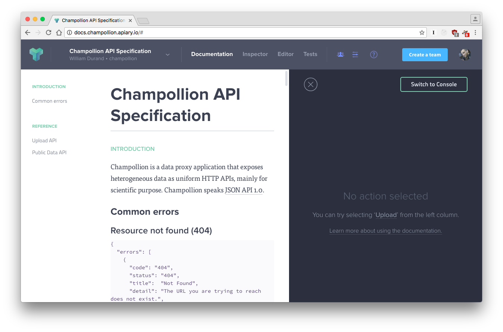

----

### Apiary<br>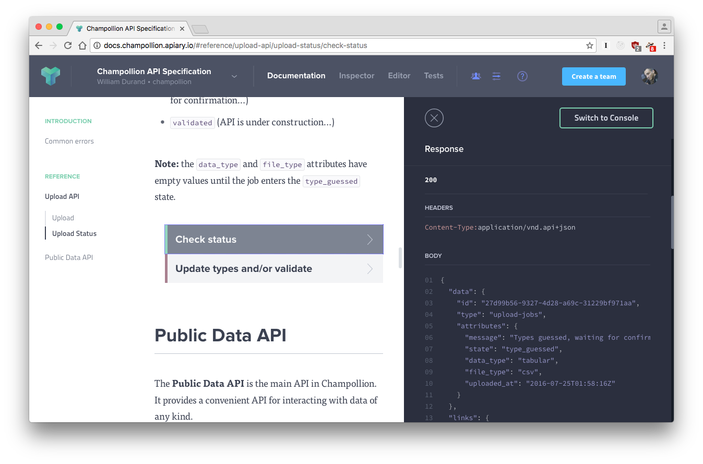

----

### Aglio<br>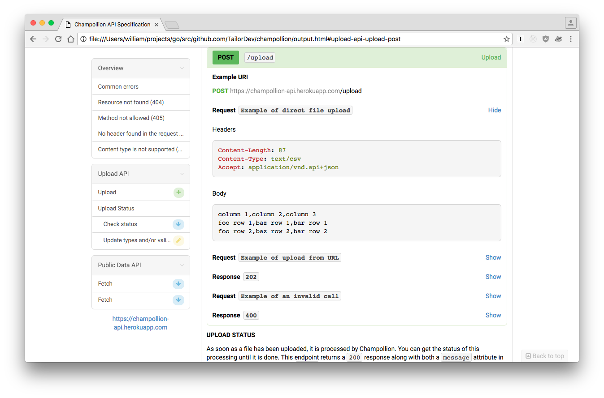

----

### Moooocks!

(Apiary / [Drakov](https://github.com/Aconex/drakov))<br>

----

### JSON Schema

(Apiary / Aglio thanks to [MSON](https://help.apiary.io/api_101/mson-tutorial/))

```
+ Attributes
    + data (object)
    	+ id: `123` (string, required) - The identifier
```

``` json
{
  "$schema": "http://json-schema.org/draft-04/schema#",
  "type": "object",
  "properties": {
    "data": {
      "type": "object",
      "properties": {
        "id": { "type": "string", "description": "The identifier" }
      },
      "required": [ "id" ]
    }
  }
}
```

----

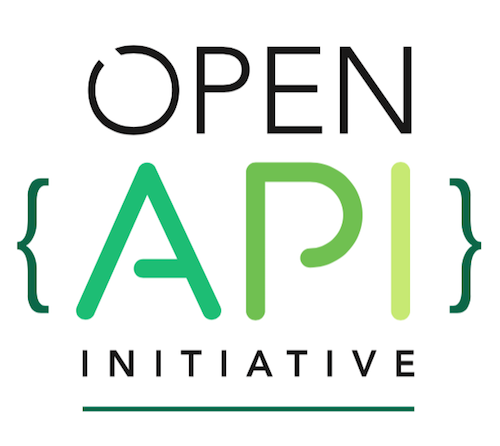


(ex-Swagger)

----

### Symfony/PHP

* NelmioApiDocBundle ([#900](https://github.com/nelmio/NelmioApiDocBundle/issues/900))
* [A Tool to Convert NelmioApiDocBundle to Swagger PHP](https://blog.liip.ch/archive/2016/05/11/convert-nelmioapidocbundle-to-swagger-php.html) by Liip (blog post)
* [Jane](https://github.com/janephp/jane) (JSON Schema) and [Jane Open Api](https://github.com/janephp/openapi) (Open API)

----

### Advices

* Write documentation first, then code
* Must be under version control
* Test your documentation (build / [Dredd](https://github.com/apiaryio/dredd))


---

## <i class="fa fa-code"></i> Code

----

### Symfony/PHP

* [Symfony REST Edition](https://github.com/gimler/symfony-rest-edition) = Great for HTTP++ APIs

* [FOSRestBundle](https://github.com/FriendsOfSymfony/FOSRestBundle) + [Hateoas](https://github.com/willdurand/Hateoas) = HAL

* [Fractal](https://github.com/thephpleague/fractal), [Negotiation](https://github.com/willdurand/Negotiation), etc.

----

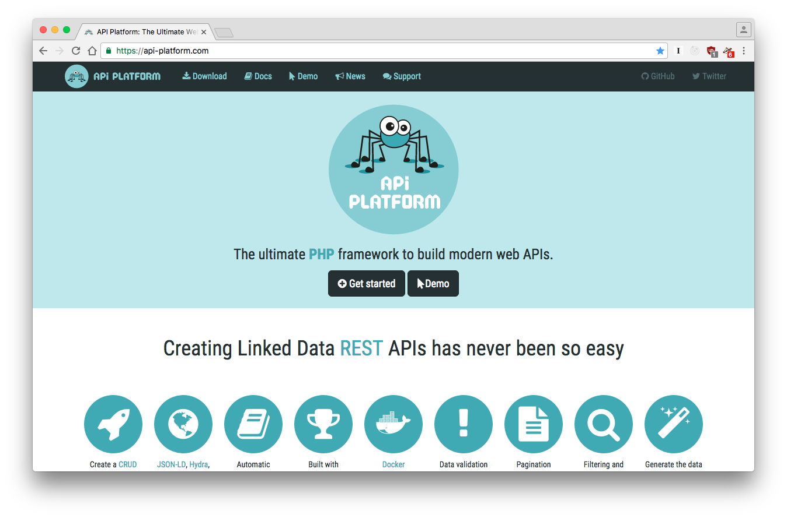


----

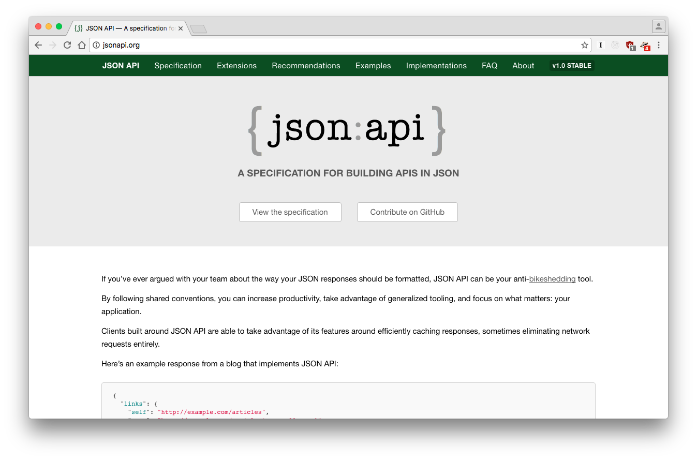


----

### JSON API

`application/vnd.api+json`

``` json
{
  "data": {
    "id": "41c6cf",
    "type": "sequence",
    "attributes": {
      "name": "> Demo 1",
      "sequence": "ATCGAATCGGTTTAAAATCGATTCCCGAAAA"
    }
  },
  "links": {
    "parent": "/data/27d99b56",
    "self": "/data/27d99b56/41c6cf",
    "source": "https://example.org/demo-sequence.fasta",
    "profile": "/profiles/data/sequence"
  }
}
```

----

### Errors

``` json
{
  "errors": [
    {
      "code": "404",
      "status": "404",
      "title":  "Not Found",
      "detail": "The URL you are trying to reach does not exist.",
      "links": {
        "about": "https://httpstatuses.com/404",
        "profile": "/profiles/errors"
      }
    }
  ]
}
```

----

### Update with ~~PUT~~ PATCH

```
PATCH /upload/jobs/27d99b56-9327-4d28-a69c-31229bf971aa

Content-Type: application/vnd.api+json
Accept: application/vnd.api+json
```
``` json
// /!\ request payload below
{
  "data": {
    "id": "27d99b56-9327-4d28-a69c-31229bf971aa",
    "type": "upload-jobs",
    "attributes": {
      "data_type": "sequence",
      "file_type": "fasta"
    }
  }
}
```

(Yes... I wrote about [PATCH'ing correctly](http://williamdurand.fr/2014/02/14/please-do-not-patch-like-an-idiot/))

----

### Sparse Fieldsets <i class="fa fa-heart"></i>
with the `fields` query parameter

```
GET /data/27d99b56?fields[sequence]=name

Accept: application/vnd.api+json
```

``` json
"data": [
  {
    "id": "41c6cf",
    "type": "sequence",
    "attributes": { "name": "> Demo 1" }
  },
  {
    "id": "787ff2",
    "type": "sequence",
    "attributes": { "name": "> Seq. 2" }
  }
]
```

----

### Filtering
with the `filter` query parameter

```
GET /data/27d99b56?fields[sequence]=sequence \
  &filter={"name": { "$regex": "/demo/", "$options": "i"}}

Accept: application/vnd.api+json
```
``` json
"data": [
  {
    "id": "41c6cf",
    "type": "sequence",
    "attributes": {
      "sequence": "ATCGAATCGGTTTAAAATCGATTCCCGAAAA"
    }
  }
]
```

----

### Pagination
with the `page` query parameter

```
{
  "data": [ ... ],
  "links": {
    "next": "/data/8f7d5ef1?page[cursor]=57de7ff7&page[limit]=1",
    "prev": "/data/8f7d5ef1?page[cursor]=-57de7ff7&page[limit]=1"
  },
  "meta": {
    "page": {
      "after": "57de7ff7",
      "before": "-57de7ff7",
      "count": 3138,
      "limit": 1
    }
  }
}
```

----

### Inclusion
with the `include` query parameter

```
GET /data/27d99b56?include=ANYTHING

Accept: application/vnd.api+json
```
```json
{
  "data": [ ... ],
  "included": [
    ANYTHING
  ]
}
```

----

### Asynchronous Processing (1/3)

```
POST /upload

Content-Length: 87
Content-Type: text/csv
Accept: application/vnd.api+json
```
```json
HTTP/1.1 202 Accepted
Content-Type: application/vnd.api+json
Content-Location: /upload/jobs/27d99b56

{
  "data": {
    "id": "27d99b56",
    "type": "upload-jobs",
    "attributes": {
      "status": "Processing..."
    }
  }
}
```

----

### Asynchronous Processing (2/3)

```
GET /upload/jobs/27d99b56

Accept: application/vnd.api+json
```
```
HTTP/1.1 303 See other
Location: /data/27d99b56
```

----

### Asynchronous Processing (3/3)

Degraded mode for browsers with the `Prefer` header

<br>

```
GET /upload/jobs/27d99b56

Accept: application/vnd.api+json
Prefer: status=201
```
```
HTTP/1.1 201 Created
Location: /data/27d99b56
```

----

### Recap'

* JSON API helps writing REST APIs

* It is OK to take shortcuts (sometimes)

* JSON schema for (application) semantics

---

## <i class="fa fa-check-circle"></i> Testing

----

### PHPUnit + Guzzle

```php
public function testPOST()
{
    // ... create Guzzle $client

    $request = $client->post('/api/programmers', null, json_encode($data));
    $response = $request->send();

    $request = $client->post('/api/programmers', null, json_encode($data));
    $response = $request->send();

    $this->assertEquals(201, $response->getStatusCode());
    $this->assertTrue($response->hasHeader('Location'));
    $data = json_decode($response->getBody(true), true);
    $this->assertArrayHasKey('nickname', $data);
}
```

<small>
Source: https://knpuniversity.com/screencast/rest/testing-phpunit
</small>

----

### Behat

```
# api/features/programmer.feature
# ...

Scenario: Create a programmer
  Given I have the payload:
    """
    {
      "nickname": "ObjectOrienter",
      "avatarNumber" : "2",
      "tagLine": "I'm from a test!"
    }
    """
  When I request "POST /api/programmers"
  Then the response status code should be 201
  And the "nickname" property should equal "ObjectOrienter"
```

<small>
Source: https://knpuniversity.com/screencast/rest/testing
</small>

----

### Chakram

``` javascript
describe("HTTP assertions", function () {
  it("should make HTTP assertions easy", function () {
    var response = chakram.get("http://httpbin.org/get?test=chakram");
    
    expect(response).to.have.status(200);
    expect(response).to.have.header("content-type", "application/json");
    expect(response).not.to.be.encoded.with.gzip;
    expect(response).to.comprise.of.json({
      args: { test: "chakram" }
    });
    return chakram.wait();
  });
}); 
```
-----
http://dareid.github.io/chakram/

----

### Frisby

``` javascript
var frisby = require('frisby');

frisby.create('Get Brightbit Twitter feed')
  .get('https://api.twitter.com/1/statuses/user_timeline.json?screen_name=brightbit')
  .expectStatus(200)
  .expectHeaderContains('content-type', 'application/json')
  .expectJSON('0', {
    user: {
      verified: false,
      location: "Oklahoma City, OK",
      url: "http://brightb.it"
    }
  })
  .toss();
```
-----
http://frisbyjs.com

----

### Dredd (for API doc)


-----
https://github.com/apiaryio/dredd

----

### Postman<br>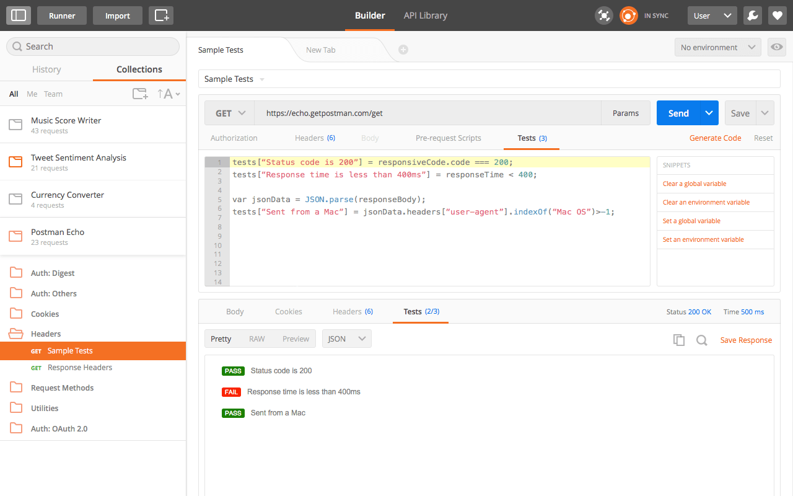

----

### Hurl . it<br>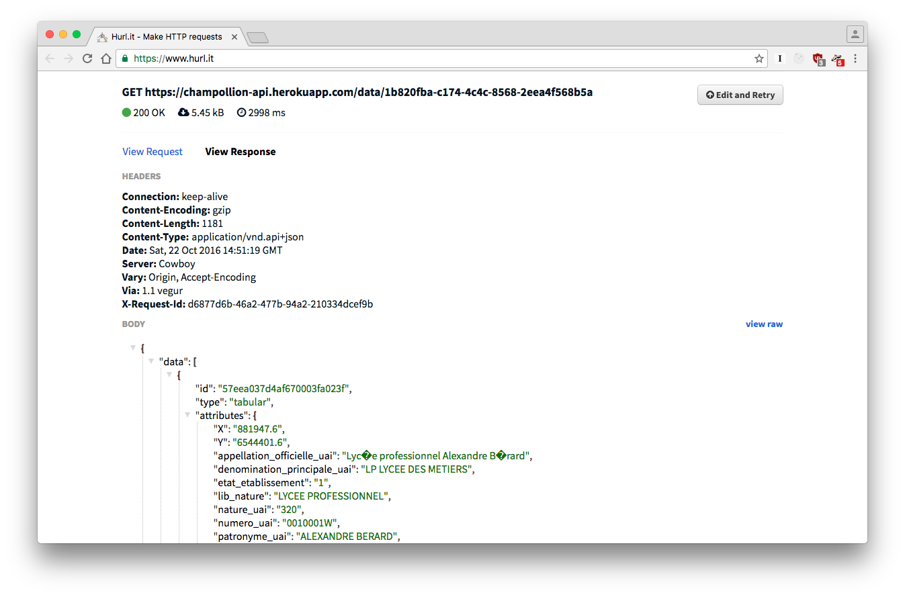

----

### And...

* [HTTPie](https://github.com/jkbrzt/httpie): cURL-like tool for humans
* [jq](https://stedolan.github.io/jq/): like `sed` for JSON data

<br>
You can add this to your `.zshrc`:

```
jsonapi() {
  http "$@" Accept:application/vnd.api+json \
            Content-Type:application/vnd.api+json
}
```

---

## Conclusion

----

### <i class="fa fa-book"></i> Documentation
1. Very important
1. Write it **first**
1. Test it

----

### <i class="fa fa-code"></i> Code
1. I <i class="fa fa-heart"></i> JSON API
1. It is OK not to be 100% REST compliant
1. **TEST YOUR API!**

----

### <i class="fa fa-check-circle"></i> Testing

1. No excuse!
1. No excuse!
1. No excuse!

---

## One More Thing

I did not talk about <i class="fa fa-lock"></i> **security**, but:
<br>
<br>

API key / Authorization header are a good start

OAuth is not for authentication, [OpenID Connect](http://openid.net/connect/) is!

JWT ([LexikJWTAuthenticationBundle](https://github.com/lexik/LexikJWTAuthenticationBundle)) is trendy

Check out [Auth0 article on Symfony](https://auth0.com/docs/quickstart/backend/php-symfony)

---

### A: I don't know.<br>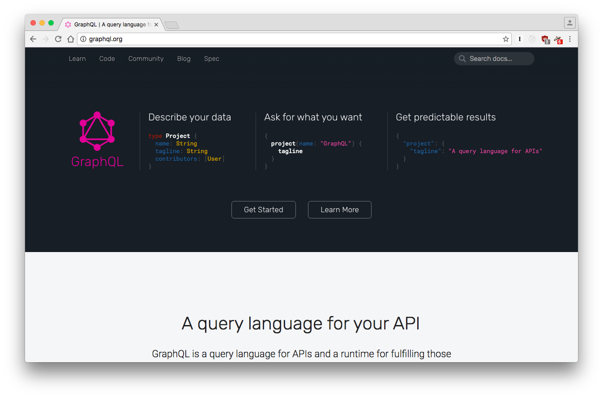

---

## Thank you.
#### Questions?

<br>
* <i class="fa fa-globe"></i> [williamdurand.fr](http://williamdurand.fr)
* <i class="fa fa-github"></i> [github.com/willdurand](https://github.com/willdurand)
* <i class="fa fa-twitter"></i> [@couac](https://twitter.com/couac)
