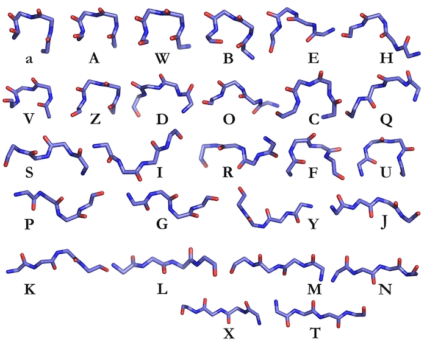
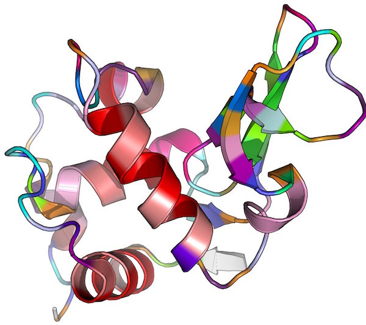
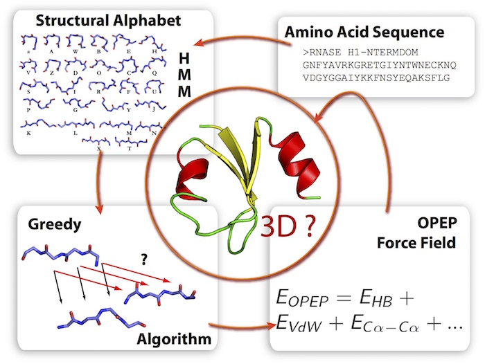
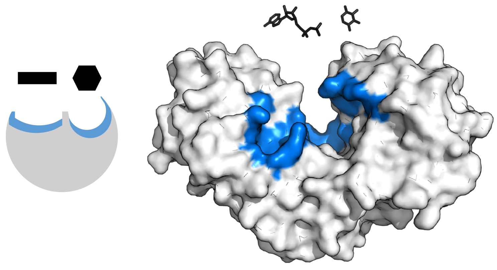
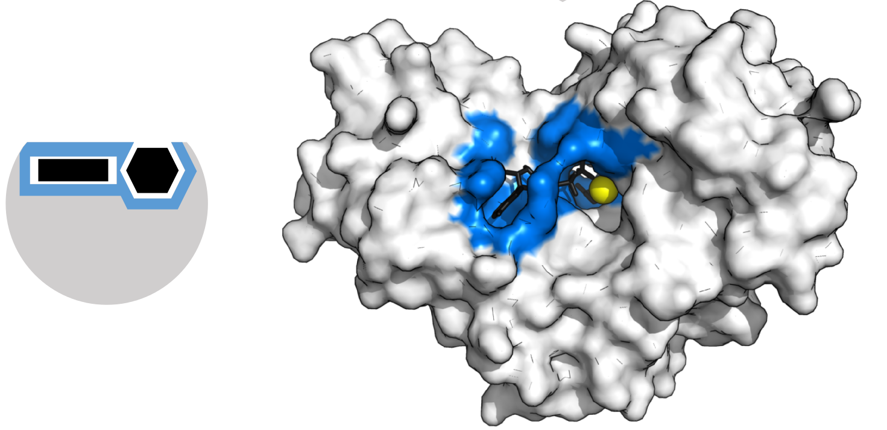
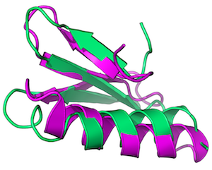

# `$ ./academia2industry`

#### Julien maupetit, PhD

<small>
Montpellier - 2016/11/15
</small>

---

## Outline

1. Education
2. Positions held
3. About TailorDev
4. Conclusions

---

## Disclaimer

> This presentation is not about trying to teach you a path to follow. My intent is to show you some paths you might not have been imagined.

---

## `$ whoami`

* <i class="fa fa-twitter"></i> [@julienmaupetit](https://twitter.com/julienmaupetit)
* Born in the 80's
* Live in [Auvergne](http://www.auvergne.fr/)
* Married, 2 children
* Co-founder of [TailorDev](https://tailordev.fr)

---

## Education

----

### _I'll be a MD_

* **1998** - Baccalauréat
* **1999 - 2000** - PCEM1, Paris 7
* **2001** - DEUG2 SNV, Paris 7

<!-- .element: class="fragment" -->

----

### BioX

**2002 - 2003**
License & Maîtrise de Biochimie, Paris 7

<small>
Image credit: David S. Goodsell - [doi:10.2210/rcsb_pdb/mom_2016_2](http://dx.doi.org/10.2210/rcsb_pdb/mom_2016_2)
</small>

----

### Bio-informatics FTW

**2004** - DEA AGM2, Paris 7

<!-- .element: class="fragment" -->

----

### Protein structure prediction

**2005 - 2007** - _PhD_

> Génération ab initio de modèles protéiques à
partir de représentations discrètes des protéines
et de critères d'énergie simplifiés.

----

### Structural alphabet (SA)

----

### SA-encoded protein

----

### Predict 3D structure from AA

----

### How predicting a protein structure could help medical research?

----

### Structure - function paradigm

<small>
Hexokinase induced fit. Source: [wikipedia](https://en.wikipedia.org/wiki/Enzyme_catalysis)
</small>

----

### Structure - function paradigm

<small>
Hexokinase induced fit. Source: [wikipedia](https://en.wikipedia.org/wiki/Enzyme_catalysis)
</small>

----

### Structure - function paradigm

* Protein design: (in|de)crease stability
* Drug design: (de)activate an interaction (metabolic pathway, quaternary structure, etc.)

---

## Positions

----

### Teaching bio-informatics

**2008** - Assistant Professor

----

### Permanent position
#### [@ParisDiderot](https://twitter.com/ParisDiderot)

**2008 - 2011** - Research Engineer

* [RPBS Platform](http://bioserv.rpbs.univ-paris-diderot.fr/index.html)
* `(bio|chemo)`-informatics
* Collaborations with wet labs
* Sysadmin

----

### 2012

#### San Diego, CA
_versus_
#### Clermont-Ferrand

----

#### Co-founder of

* First experience in the "industry"
* Various application domains
* <i class="fa fa-level-up"></i> development skills

----

#### Co-founder of

* Technology-agnostic user group
* Recurrent events: [APIHours](http://clermontech.org/api-hours/)

---

## Tailordev

----

### The big picture.

> Our mission is to develop modern tools to ease scientific work and promote **Open Data**, **Open Science** and **Open Source** in research entities.

[https://tailordev.fr](https://tailordev.fr)

----

### Manifesto

* Open Science pillars
* Users are contributors
* Openness & privacy must coexist
* Transparency & ethics first

----

#### That's nice, but...
### what is your "real job" now?

----

### Scientific development
#### as a Service

* **Technical consultant**: introduce new tools & technologies, best coding practices, etc.
* **Developers**: structure, open and mine research data (data modeling, APIs, interfaces)
* Research labs from both Academia & the Industry

----

### Software as a Service

> In collaboration with RPBS, we will launch a new paid service for peptide structure prediction (Q2 2017).

----

### My activity

| Task        | Ratio |
|-------------| -----:|
| Programing  |   50% |
| Business    |   40% |
| Communities |   10% |

---

## Conclusions

----

### 1. Biology & informatics

> Stay humble but know what you are worth.

----

### 2. Communities

> Get involved

> Get out of your comfort zone and talk to people

----

### 3. To infinity & beyond

> Make your own path in both Academia & the Industry
